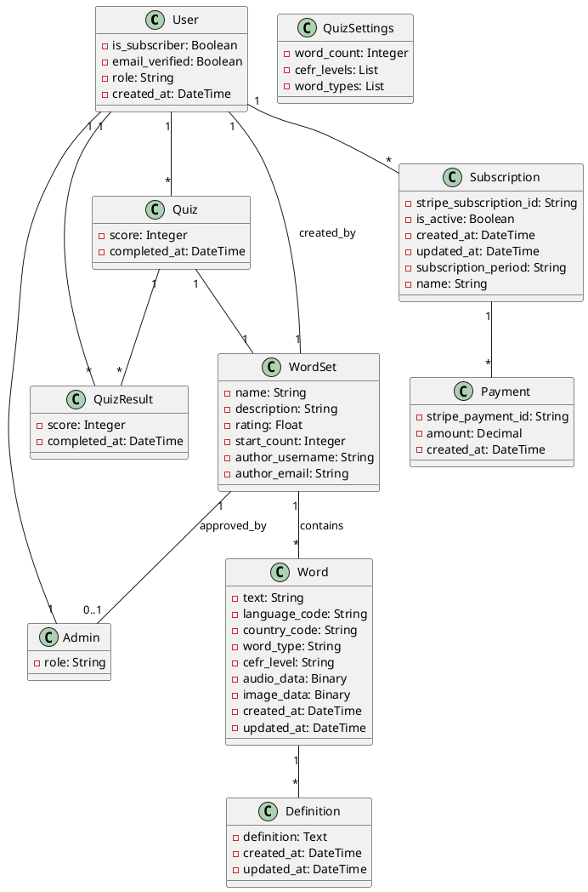

# Pimp My English && Learn by gaming!

**Pimp My English** is an interactive educational platform designed to enhance your English vocabulary through engaging quizzes. The platform allows users to test their knowledge of words, create personalized word sets, and access a variety of quizzes tailored to different levels of language proficiency.

This README file provides an overview of the project, detailing its purpose, features, structure, and setup instructions.

---

## Table of Contents
1. [Introduction](#introduction)
2. [Features](#features)
3. [Technologies](#technologies)
4. [Project Architecture](#project-architecture)
5. [Database Structure](#database-structure)
6. [User Stories](#user-stories)
7. [UX/UI Design](#uxui-design)
8. [Testing](#testing)
9. [Deployment](#deployment)
10. [Future Features](#future-features)
11. [Acknowledgements](#acknowledgements)
12. [License](#license)

---

## Introduction

**Pimp My English** is more than just a vocabulary quiz platform; it is an immersive learning environment where users can:

- **Test their vocabulary knowledge**: Users can take quizzes that challenge their understanding of word definitions and usage.
- **Create personalized word sets**: Subscribers have the ability to create and customize word sets to focus on their individual learning needs.
- **Responsive Design**: Thanks to the responsive design implemented in the project, users can comfortably interact with quizzes on various devices, from large screens to smartphone displays.
- **Automatic Word Set Ratings**: Word sets are automatically rated based on the number of times they have been started. The ratings are available to users when selecting a word set, providing a quick and easy way to identify popular and frequently used sets.

The platform aims to provide a comprehensive learning tool that is both educational and entertaining, fostering a deeper engagement with the English language.

---

## Features

### User Authentication and Roles
- **Subscribers**: Authorized users with paid subscriptions can create and edit word sets, access their profile with detailed subscription information, and manage word sets they have created.
- **Guests**: Unregistered users can access preset and shared word sets to quickly test their vocabulary skills without registration.
- **Admin**: Administrators have full control over platform content and user management, including subscription plans and user roles.

### Interactive Quizzes
- **Engaging Quizzes**: Quizzes challenge users to guess words by their definitions, with each question having a time limit.
- **Variety of Word Sets**: Users can select from a variety of word sets based on their proficiency level and interests.
- **Real-time Feedback**: Users receive immediate feedback in the form of a results table displayed in the browser for the current session, allowing them to track their estimated time, correct and incorrect answers.

### Word Set Management
- **Create and Edit Word Sets**: Subscribers can create personalized word sets and edit existing ones.
- **Rating System**: Word sets can be rated automatically based on the number of times they have been started, with the ratings displayed when selecting a word set.
- **Sharing and Collaboration**: Users share their word sets with others and see immediate feedback through the word set ratings.

### Subscription and E-Commerce Integration
- **Subscription Plans**: Users can purchase subscriptions to create and customize word sets.
- **Secure Payments**: Integration with Stripe ensures secure payment processing for subscriptions.
- **Subscription Management**: Users can manage their subscription plans, including renewals and cancellations with just a few clicks, thanks to Stripe integration and a well-thought-out commercial component.

---

## Technologies

### Backend
- **Python**: 3.12.3
- **Django**: 5.0.6
  - **Django REST framework**: 3.15.1
  - **dj-database-url**: 0.5.0 (Database configuration)
  - **django-allauth**: 0.63.3 (Security and Authentication)
  - **sqlparse**: 0.5.0 (SQL parsing for Django)
  - **asgiref**: 3.8.1 (ASGI support for Django)

### Frontend
- **HTML**
- **CSS**
- **JavaScript**

### Database
- **PostgreSQL**
- **psycopg2-binary**: 2.9.9 (PostgreSQL database adapter)

### Payment Processing
- **Stripe API**: 9.12.0

### Email Services
- **MailChimp**: 3.0.21

### Security and Authentication
- **django-allauth**: 0.63.3
- **PyJWT**: 2.8.0

### Configuration Management
- **python-decouple**: 3.8
- **python-dotenv**: 1.0.1

### Request Handling
- **requests**: 2.32.3
- **urllib3**: 2.2.2

### Static Files Management
- **whitenoise**: 6.7.0

### Web Server
- **gunicorn**: 20.1.0

### Other Dependencies
- **certifi**: 2024.6.2 (Certificate validation)
- **cffi**: 1.16.0 (Foreign Function Interface for Python)
- **charset-normalizer**: 3.3.2 (Encoding detection)
- **cryptography**: 42.0.8 (Cryptographic recipes and primitives)
- **idna**: 3.7 (Internationalized Domain Names in Applications)
- **tzdata**: 2024.1 (Time zone database)
- **typing_extensions**: 4.11.0 (Backport of Python typing features)

---

## Project Architecture

### Project Structure

The **Pimp My English** project is organized into several Django applications and directories, each serving a specific purpose. Below is an overview of the main components and their functionalities:

- **accounts**: Manages user authentication, profiles, and email templates for various account-related actions such as signup, login, and password reset.

- **admin_app**: Provides administrative functionalities, including managing users and content.

- **pimp_my_english**: The main application configuration and settings for the Django project.
  - **settings.py**: Configures project settings.
  - **urls.py**: Defines the URL routing for the project.

- **quizzes**: Manages the quiz functionality, including creating and taking quizzes.

- **subscriptions**: Manages subscription plans, payments, and user access control based on subscriptions.

- **wordsets**: Manages word sets, including creating, editing, and rating word sets.
  - **utils.py**: Contains utility functions, including the rating calculation.

- **static**: Contains static files such as CSS, JavaScript, and images.
  - **css**: Stylesheets for the project.
  - **js**: JavaScript files for interactivity.
  - **images**: Images used in the project, including logos and icons.

- **templates**: Global templates used across the project.
  - **base.html**: The base template for the project.
  - **home.html**: The homepage template.
  - **landing.html**: The landing page template.
  - **contact.html**: The contact page template.

### Key Functionalities

- **User Authentication and Roles**:
  - Managed by the `accounts` application.
  - Supports subscriber, guest, and admin roles with different access levels.

- **Interactive Quizzes**:
  - Managed by the `quizzes` application.
  - Includes engaging quizzes with real-time feedback and a variety of word sets.

- **Word Set Management**:
  - Managed by the `wordsets` application.
  - Allows creating, editing, rating, and sharing word sets.

- **Subscription and E-Commerce Integration**:
  - Managed by the `subscriptions` application.
  - Supports subscription plans, secure payments via Stripe, and easy subscription management.

This architecture ensures a modular and scalable project structure, making it easy to manage and extend the functionalities of the **Pimp My English** platform.

---

## Database Structure

The **Pimp My English** project uses a PostgreSQL database to manage various aspects of the application, including users, quizzes, subscriptions, and word sets. Below is an overview of the main models and their relationships.

### Models Overview

#### User Models

- **User**: Extends the default Django user model to include additional fields like `is_subscriber`, `email_verified`, and `role`. 
- **Admin**: Represents an admin user with a specific role, linked to the `User` model.

#### Quiz Models

- **Quiz**: Represents a quiz taken by a user, linked to a specific word set.
- **QuizResult**: Stores the results of a quiz.
- **QuizSettings**: Stores settings for quizzes, such as word count and CEFR levels.

#### Subscription Models

- **Subscription**: Represents a user's subscription plan, including details like the Stripe subscription ID and whether the subscription is active.
- **Payment**: Stores payment information related to a subscription.

#### Word Set Models

- **WordSet**: Represents a collection of words with a name, description, rating, and other metadata. Linked to the `User` model for the creator and the `Admin` model for approval.
- **Word**: Represents a single word with additional metadata like language code, country code, word type, and CEFR level.
- **Definition**: Stores definitions for words.

### UML Diagram




---

## User Stories

### As a Subscriber:
- I want to create my own sets of words to personalize my learning experience.
- I want to customize existing sets of words to better fit my vocabulary needs.
- I want to share my word sets with others to help them learn.
- I want to participate in the ranking of word sets to see how my contributions compare to those of other learners.
- I want to log into the site to access my subscriptions settings and word sets.
- I want to edit and delete my word sets if needed.
- I want to easy purchase a subscription to access additional features and word sets.
- I want to manage my subscription and payment details securely.

### As a Guest:
- I want to access preset and shared word sets without registering to start learning immediately.
- I want to use the platform without registration or login to quickly test my vocabulary skills.
- I want to understand the benefits of becoming a subscriber and the available subscription options.

### As a Subscriber Or a Guest:
- I want to see basic statistics for my current session to monitor my immediate learning outcomes.
- I want to easily subscribe to project newsletters to stay updated with new features and updates.
- I want to be able to ask questions and provide feedback to improve the platform.
- I want to see before quiz start the ratings of word sets to make a more informed choice.

### As an Admin:
- I want to manage the entire platform to ensure smooth operations and content quality.
- I want to remove inappropriate content or user accounts to maintain a safe and positive learning environment.

---

## UX/UI Design

The platform's design focuses on creating an immersive and enjoyable learning experience. The user interface (UI) is intuitive and easy to navigate, ensuring that users of all ages and technical abilities can use the platform effectively. Here are some key elements of the UX/UI design:

### Dark Decadence Style

The platform adopts a **dark decadence** style, characterized by rich, deep colors that create an elegant and sophisticated look. This style is not only visually appealing but also reduces eye strain, making it easier for users to spend more time learning.

### Color Palette

The platform uses a calming and professional color palette to create a conducive learning environment. Accent colors are used sparingly to highlight key actions and important information. The dark mode design is enhanced by:

- **Primary Background**: Deep charcoal and black tones to minimize screen glare and provide a luxurious feel.
  - Example:  `#000000`
  - Example:  `#272222`

- **Text Colors**: Soft whites and light grays for readability against the dark background.
  - Example:  `#FFFFFF`
  - Example:  `#CCCCCC`

- **Accent Colors**: Golds, deep reds, rich purples, greenish tones, and bluish tones to draw attention to critical features without overwhelming the user.
  - Example:  `#FFD700`
  - Example:  `#7B518D`
  - Example:  `#A1385C`
  - Example:  `#4CAF50`
  - Example:  `#00BCD4`

### Typography

The platform uses clean and modern fonts that are easy to read on both desktop and mobile devices. Headings and key text elements are slightly larger and bolder to provide a clear visual hierarchy.

- **Primary Font**: 'Lato', sans-serif
  - Example: 
- **Accent Font**: 'Caveat', cursive
  - Example: 

### Key Design Elements

- **Responsive Layout**: The platform is designed to work seamlessly across various devices, including desktops, tablets, and smartphones. This ensures that users can access their word sets and quizzes on the go.
- **Consistent Navigation**: A consistent and intuitive navigation structure helps users easily find what they need. Key actions, such as starting a quiz, managing word sets, and viewing statistics, are prominently displayed and accessible with minimal clicks.
- **Visual Feedback**: Immediate visual feedback is provided for user actions, such as answering quiz questions, updating word sets, and managing subscriptions. This helps users understand the impact of their actions and provides a sense of progression.

### Visual Design Components

- **Color Scheme**: The platform uses a calming and professional color palette to create a conducive learning environment. Accent colors are used sparingly to highlight key actions and important information.
- **Typography**: Clear and readable fonts are used throughout the platform. Different font sizes and weights help to create a visual hierarchy, making it easier for users to scan and understand the content.
- **Icons and Imagery**: Relevant icons and images are used to enhance the user experience. For example, star icons are used to represent word set ratings, and illustrative images are included in quizzes to aid in word association.
  - Example of Star Rating: 
- **Interactive Elements**: Buttons, sliders, and other interactive elements are designed to be easily clickable and responsive. Disabled states are visually distinct to indicate when actions are not available.
  - Example of Button: 
  - Example of Disabled Button: 

### User Flows

1. **Subscriber User Flow**:
   - **Profile**: Access to personalized word sets, and subscription details. View and manage subscription plans, payment detail.
   - **Quiz Maker**: Easy-to-use forms for creating and editing word sets.
   - **Quiz**: Selection of word sets, quiz settings, and immediate feedback on performance.

2. **Guest User Flow**:
   - **Home Page**: Quick access to preset and shared word sets.
   - **Start Quiz**: Immediate start of quizzes without the need for registration.
   - **Winners Results tab**: View basic statistics for the current session, encouraging further engagement.

3. **Admin User Flow**:
   - **Admin Dashboard**: Overview of platform activity, user management, and content control.
   - **Manage Word Sets**: Add, edit, approve, or remove any project entities.

### Accessibility Considerations

- **Keyboard Navigation**: The platform is fully navigable using a keyboard, ensuring accessibility for users with mobility impairments.
- **Screen Reader Support**: All interactive elements and important content are labeled appropriately to provide a seamless experience for users relying on screen readers.
- **Color Contrast**: High contrast ratios are used to ensure readability for users with visual impairments.

By prioritizing user needs and employing best practices in UX/UI design, we aim to create a platform that is not only effective in facilitating learning but also enjoyable to use.

---

## Deployment

The deployment process for the platform involves setting up the application environment, configuring the database, and loading necessary fixtures to populate the initial data. Here are the steps to deploy the platform:

### Prerequisites

Ensure you have the following installed:
- Python 3.8+
- Django 3.2+
- PostgreSQL
- Heroku CLI (if deploying to Heroku)

### Environment Setup

1. **Clone the Repository**:
    ```bash
    git clone https://github.com/your-repo/your-project.git
    cd your-project
    ```

2. **Create a Virtual Environment**:
    ```bash
    python -m venv venv
    source venv/bin/activate   # On Windows use `venv\Scripts\activate`
    ```

3. **Install Dependencies**:
    ```bash
    pip install -r requirements.txt
    ```

4. **Set Up Environment Variables**:
    Create a `.env` file in the root directory and add the necessary environment variables:
    ```
    DATABASE_URL:            postgres://{user}:{password}@{hostname}:{port}/{database-name}
    DEBUG:                   False
    DEFAULT_FROM_EMAIL:      project-from-email@gmail.com
    DISABLE_COLLECTSTATIC:   1
    EMAIL_BACKEND:           django.core.mail.backends.smtp.EmailBackend
    EMAIL_HOST_PASSWORD:     project-from-email@gmail.com google app api password
    EMAIL_HOST_USER:         project-from-email@gmail.com
    MAILCHIMP_API_KEY:       mailchimp_api_key
    MAILCHIMP_DATA_CENTER:   mailchimp_data_center_prefix
    MAILCHIMP_EMAIL_LIST_ID: mailchimp_email_list_id
    SECRET_KEY:              django_secret_key
    STRIPE_PRICE_ID:         stripe_price_id
    STRIPE_PUBLIC_KEY:       stripe_public_key
    STRIPE_SECRET_KEY:       stripe_secret_key
    STRIPE_WH_SECRET:        stripe_webhook_secret
    ```

### Database Configuration

1. **Run Migrations**:
    ```bash
    python manage.py migrate
    ```

2. **Load Fixtures**:
    To load initial data into the database, use the following commands:

    ```bash
    python manage.py loaddata wordsets/fixtures/wordsets_fixture.json
    python manage.py loaddata wordsets/fixtures/wordsets_and_word_fixture.json
    ```

### Running the Application

1. **Start the Development Server**:
    ```bash
    python manage.py runserver
    ```

2. **Create a Superuser**:
    ```bash
    python manage.py createsuperuser
    ```

### Deployment to Heroku

1. **Log in to Heroku**:
    ```bash
    heroku login
    ```

2. **Create a New Heroku App**:
    ```bash
    heroku create pme
    ```

3. **Set Heroku Environment Variables**:
    ```bash
    heroku config:set DEBUG=False
    heroku config:set SECRET_KEY=your_secret_key
    heroku config:set ALLOWED_HOSTS=your-app-name.herokuapp.com
    ... (see above full list)
    ```

4. **Add PostgreSQL Add-on**:
    ```bash
    heroku addons:create heroku-postgresql:hobby-dev
    ```

5. **Deploy to Heroku**:
    ```bash
    git push heroku main
    heroku run python manage.py migrate
    heroku run python manage.py loaddata wordsets/fixtures/wordsets_fixture.json
    heroku run python manage.py loaddata wordsets/fixtures/wordsets_and_word_fixture.json
    heroku run python manage.py createsuperuser
    ```

### Testing the Deployment

1. **Access the Application**:
    Open your browser and go to `https://your-app-name.herokuapp.com`.

2. **Log in to the Admin Panel**:
    Go to `https://your-app-name.herokuapp.com/admin` and log in using the superuser credentials created earlier.

3. **Verify Data**:
    Check that the initial data loaded correctly and that the application functions as expected.

4. **Stripe payments test data**:
    For testing Stripe payments through the subscription feature, use the following test card details:
    
    **Card Number: 4242 4242 4242 4242**

    This card number can be used to create successful test payments during development.

By following these steps, you will have your platform up and running with the necessary initial data loaded and ready for users.

---

## Future Features

We have exciting plans to enhance the learning experience on our platform. Here are the upcoming features we are planning to implement:

### Multi-language Quizzes

To make our platform more inclusive and cater to a wider audience, we plan to introduce multi-language quizzes. This feature will allow users to take quizzes in different languages, starting with the Irish language. This will help users learn and practice new languages, expanding their vocabulary and language skills beyond English.

#### Planned Languages:
1. **Irish (Gaeilge)**: As our first additional language, users will be able to take quizzes in Irish, covering vocabulary and grammar specific to the Irish language.

### Enhanced Quiz Modes

We are planning to introduce new quiz modes to provide a more diverse and engaging learning experience. These modes will include:
1. **Reverse Quizzes**: In this mode, users will guess definitions based on the given words. This will enhance their understanding and retention of word meanings.
2. **Audio Quizzes**: Users will listen to audio pronunciations and guess the corresponding words. This mode aims to improve listening skills and pronunciation accuracy.

---

## Acknowledgments

- **My sister** - Eleonora Rastvorova - who inspired me to create this project.
- **My family** - Darya, Veronika, and Elmira - who support and encourage me.
- **My Mentor** - Oluwafemi Medale - for continuous helpful feedback.
- **My Cohort Facilitator** - Marko Tot - for the timely and great advice.
- **Code Institute** - for my professional growth and the great opportunity to make something useful for people.

---

## License

- This project is licensed under the MIT License.


[Back to Table of Contents](#table-of-contents)
