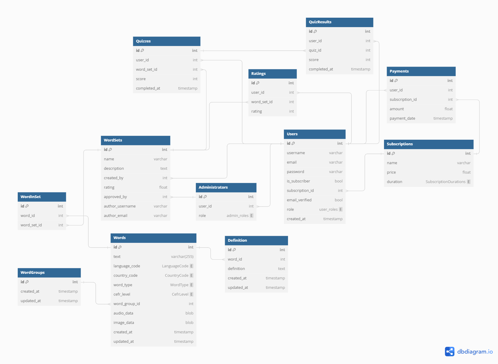

# Pimp My English

## Description
"Pimp My English" is an interactive e-commerce project designed to assist in learning English vocabulary through quizzes. This platform allows users to enhance their vocabulary by testing their knowledge of words and their definitions, as well as sharing their lexical creations with others. Subscribers can access additional features and word sets through paid subscriptions.

## Technologies
- **Backend**: Python 3.12.3, Django 5.0
- **Frontend**: HTML, CSS, JavaScript
- **Database**: SQLite (development), PostgreSQL (production)
- **Payment Processing**: Stripe API

## Project Architecture
Following best practices, the functionality of this project is divided into separate Django apps based on their purpose. The project utilizes the following apps:

1. **Accounts**

    Description: User management and authentication.

    Main Tasks:
    - User registration
    - User login and logout
    - Email verification
    - Access control (guest, subscriber, and admin roles)

    Models:
    - User (Django's built-in model)

    URL Routes:
    - /accounts/register/
    - /accounts/login/
    - /accounts/logout/
    - /accounts/verify-email/

2. **Subscriptions**
    
    Description: Subscription and payment management (Stripe integration).

    Main Tasks:
    - Create and manage subscriptions
    - Integrate with Stripe for payment processing
    - Track subscription status

    Models:
    - Subscription
    - Payment

    URL Routes:
    - /subscriptions/
    - /subscriptions/subscribe/
    - /subscriptions/manage/
    - /subscriptions/cancel/
    - /subscriptions/payments/

3. **Wordsets**

    Description: Manage word sets, definitions, examples, and ratings.

    Main Tasks:
    - Create and edit word sets
    - Add and manage words in sets
    - Rating system for word sets
    - Process user and system ratings

    Models:
    - WordSet
    - Word
    - Definition
    - WordGroup

    URL Routes:
    - /wordsets/
    - /wordsets/create/
    - /wordsets/<id>/
    - /wordsets/<id>/edit/
    - /wordsets/<id>/rate/

4. **Quizzes**

    Description: Implement quiz functionality and track results.

    Main Tasks:
    - Create and manage quizzes
    - Allow users to take quizzes
    - Track and store quiz results
    - Time limits for questions

    Models:
    - Quiz
    - QuizResult

    URL Routes:
    - /quizzes/
    - /quizzes/start/
    - /quizzes/<id>/
    - /quizzes/<id>/results/

5. **Admin**

    Description: Administrative app for content, user, and subscription management.

    Main Tasks:
    - Manage users and their roles
    - Administer content (word sets, words, and quizzes)
    - Manage subscription plans and payments
    - Reports and metrics for system monitoring

    Models:
    - Uses models from other apps

    URL Routes:
    - /admin/users/
    - /admin/wordsets/
    - /admin/quizzes/
    - /admin/subscriptions/
    - /admin/reports/

This separation of functionality allows for better code organization, task distribution among developers, and easier future development and maintenance of the project.

```uml
Project structure:

pimp_my_english/
│
├── accounts/
│   ├── migrations/
│   ├── templates/
│   ├── urls.py
│   ├── views.py
│   ├── models.py
│   └── ...
│
├── subscriptions/
│   ├── migrations/
│   ├── templates/
│   ├── urls.py
│   ├── views.py
│   ├── models.py
│   └── ...
│
├── wordsets/
│   ├── migrations/
│   ├── templates/
│   ├── urls.py
│   ├── views.py
│   ├── models.py
│   └── ...
│
├── quizzes/
│   ├── migrations/
│   ├── templates/
│   ├── urls.py
│   ├── views.py
│   ├── models.py
│   └── ...
│
├── admin/
│   ├── migrations/
│   ├── templates/
│   ├── urls.py
│   ├── views.py
│   └── ...
│
├── manage.py
└── pimp_my_english/
    ├── settings.py
    ├── urls.py
    ├── wsgi.py
    └── ...

```

## Features
### Authentication and User Roles
- **Subscribers**: Authorization on the platform is required for subscribers. Subscribers have access to all platform features, including creating and editing word sets, through paid subscriptions.
- **Guests**: Can use the service without registration or authorization, limited to accessing preset and shared word sets. This role also has all of the registered Users, but don't has subscription.
- **Admin**: Have full control over the platform's content and user management. They can configure and customize various aspects of the platform, such as subscription plans, pricing, and user roles.

### Interactive Quizzes
- The quiz consists of preset or subscriber-shared word sets.
- Quizzes challenge users to choose the correct answers from given options based on word definitions.
- Each question has a time limit, and users can move to the next question by pressing the "Skip" button.

### Ratings
- Word sets are rated on a five-star system, which takes into account both user ratings and frequency of use.
- The overall rating of each word set is calculated as an average between user ratings and the automatically calculated usage rating.

### E-Commerce and Subscriptions
- Users can purchase subscriptions to access additional features and word sets.
- The Stripe API is integrated to handle secure online payments and subscription management.
- Subscribers have access to exclusive word sets, customization options, and advanced statistics.

## Profile Section
The Profile section of the site provides users with detailed information about their account. It includes:
- **Current Subscription**: Displays the user's current subscription plan, renewal date, and subscription details.
- **Subscription History**: A history of all past subscriptions, including dates and plan details.
- **Created Word Sets**: Lists word sets created by the user, with options to edit or delete them.
- **Quiz Statistics**: Displays statistics of quizzes taken by the user, including scores and progress over time.
- **Account Information**: Allows users to view and update their account information such as username, email, and password.

## Rules
- After registration, users must verify their email addresses.
- Before purchasing a subscription, the user's role is set to `guest`.
- At the end of each calendar year, all `guest` users created more than a year ago (based on the `created_at` field) will be removed from the system.
- When a user is deleted, all associated data will be cascaded and deleted, except for word sets (`WordSets`).
- Word sets created by deleted users will be preserved with the author's information `username` (in open form) and `email` address (in closed form), respectively.

## UX/UI
### Site Goals
The primary goal of "Pimp My English" is to create a motivating and accessible environment that encourages users to engage with English vocabulary through interactive quizzes. The platform aims to facilitate effective learning by allowing users to test, expand, and share their vocabulary knowledge. Additionally, the e-commerce component provides a sustainable revenue model to support the platform's development and maintenance.

### Design Choices
The design of "Pimp My English" is simple yet effective, focusing on user experience with intuitive navigation and modern controls. The interface is designed to be user-friendly, minimizing distractions and focusing on quiz interaction to enhance learning outcomes. The e-commerce integration is seamless, with a smooth checkout process and clear subscription options.

## User Stories

### As a Subscriber:
- I want to be able to create my own sets of words so that I can personalize my learning experience.
- I want to customize existing sets of words to better fit my vocabulary needs.
- I want to view statistics of all my games to track my learning progress.
- I want to share my word sets with others to help them learn.
- I want to participate in the ranking of word sets to see how my contributions compare to those of other learners.
- I want to log into the site to access my personalized settings and word sets.
- I want to be able to edit and delete my word sets if needed.
- I want to review and edit my account information to keep my profile up-to-date.
- I want to purchase a subscription to access additional features and word sets.
- I want to manage my subscription and payment details securely.

### As a Guest:
- I want to access preset and shared word sets without registering so I can start learning immediately.
- I want to use the platform without any registration or login to quickly test my vocabulary skills.
- I want to see the basic statistics for my current session to monitor my immediate learning outcomes.
- I want to understand the benefits of becoming a subscriber and the available subscription options.

### As an Admin:
- I want to manage the entire platform to ensure smooth operations and content quality.
- I want to add new word sets or to approved Subscriber's word sets to expand the learning resources available.
- I want to edit existing word sets to ensure they are accurate and up-to-date.
- I want to remove inappropriate content or user accounts to maintain a safe and positive learning environment.
- I want to manage financial transactions and oversee the subscription process to ensure it runs smoothly.
- I want to monitor subscription metrics and revenue to make informed business decisions.

### Wireframes
Wireframes for "Pimp My English" were developed to plan the layout and interaction of the web interface. [Link or description of where wireframes can be accessed] will provide insights into the design and functionality envisioned for the platform.

### Database Structure
The database for "Pimp My English" is structured to support a robust e-commerce and educational platform:

- **Users**: Stores user information, including username, email, password, subscription details, user role (guest or subscriber), email verification status, and creation timestamp.
- **Administrators**: Stores information about platform administrators, including their user ID.
- **WordSets**: Contains collections of words, each with definitions, usage examples, name, description, rating, creator (user ID), approval status (administrator ID), and author information (username and email).
- **Words**: Stores individual words, their definitions, examples, audio, images, and the associated word set.
- **WordGroups**: Groups words across different languages.
- **Quizzes**: Links users to their quiz results, including the user ID, word set used, score, and completion timestamp.
- **Ratings**: Manages the rating system for word sets, including user feedback (user ID, word set ID, and rating value).
- **Subscriptions**: Handles subscription plans, pricing, duration (monthly or yearly), and name.
- **Payments**: Stores payment information and transaction history for subscriptions, including user ID, subscription ID, amount, and payment date.
- **QuizResults**: Stores the results of individual quiz attempts, including user ID, quiz ID, score, and completion timestamp.

```dbml
Enum SubscriptionDurations {
    monthly
    yearly
}

Table Users {
    id int [pk]
    username varchar
    email varchar
    password varchar
    is_subscriber bool
    subscription_id int [ref: > Subscriptions.id]
    email_verified bool
    role user_roles
    created_at timestamp
}

Enum user_roles {
    guest
    subscriber
}

Table Administrators {
    id int [pk]
    user_id int [ref: > Users.id]
    role admin_roles
}

Enum admin_roles {
    admin
}

Table WordSets {
    id int [pk]
    name varchar
    description text
    created_by int [ref: > Users.id]
    rating float
    approved_by int [ref: > Administrators.id]
    author_username varchar
    author_email varchar
}

Table WordGroups {
    id int [pk, increment]
    created_at timestamp
    updated_at timestamp
}

Enum WordType {
    noun
    verb
    adjective
    adverb
    pronoun
    preposition
    conjunction
    interjection
}

Enum CefrLevel {
    A1
    A2
    B1
    B2
    C1
    C2
}

Enum LanguageCode {
    en
    ru
    ua
    # добавить другие коды языков по ISO 639-1
}

Enum CountryCode {
    US
    UK
    RU
    UA
    # добавить другие коды стран по Alpha-2 ISO 3166-1
}

Table Words {
    id int [pk, increment]
    text varchar(255)
    language_code LanguageCode // Код языка по ISO 639-1
    country_code CountryCode // Код страны по Alpha-2 ISO 3166-1
    word_type WordType // Тип слова
    cefr_level CefrLevel // Уровень CEFR
    word_group_id int [ref: > WordGroups.id] // Ссылка на группу слов
    audio_data blob // Данные аудиофайла
    image_data blob // Данные изображения
    created_at timestamp
    updated_at timestamp
}

Table WordInSet {
    id int [pk, increment]
    word_id int [ref: > Words.id]
    word_set_id int [ref: > WordSets.id]
}

Table Definition {
    id int [pk, increment]
    word_id int [ref: > Words.id]
    definition text
    created_at timestamp
    updated_at timestamp
}

Table Quizzes {
    id int [pk]
    user_id int [ref: > Users.id]
    word_set_id int [ref: > WordSets.id]
    score int
    completed_at timestamp
}

Table QuizResults {
    id int [pk]
    user_id int [ref: > Users.id]
    quiz_id int [ref: > Quizzes.id]
    score int
    completed_at timestamp
}

Table Ratings {
    id int [pk]
    user_id int [ref: > Users.id]
    word_set_id int [ref: > WordSets.id]
    rating int
}

Table Subscriptions {
    id int [pk]
    name varchar
    price float
    duration SubscriptionDurations
}

Table Payments {
    id int [pk]
    user_id int [ref: > Users.id]
    subscription_id int [ref: > Subscriptions.id]
    amount float
    payment_date timestamp
}

```




## Testing
- Description of manual testing of site functionality.
- Plans to implement automated tests to improve development.

## Deployment
- Instructions for deployment on Heroku, including database setup and environment configuration.
- Integration of Stripe API for secure payment processing.

## Acknowledgements
- Links to used resources, codes, images, and texts, citing authorship and sources.

## Future Features
- Implement different administrator roles, such as owner, content manager, and support, to better manage and maintain the platform.
- Expansion of functionality to include voice commands and multilingual word sets.
- Introduction of gamification elements to increase user engagement.
- Integration with additional payment gateways for broader accessibility.

## License
This project is distributed under the MIT License.